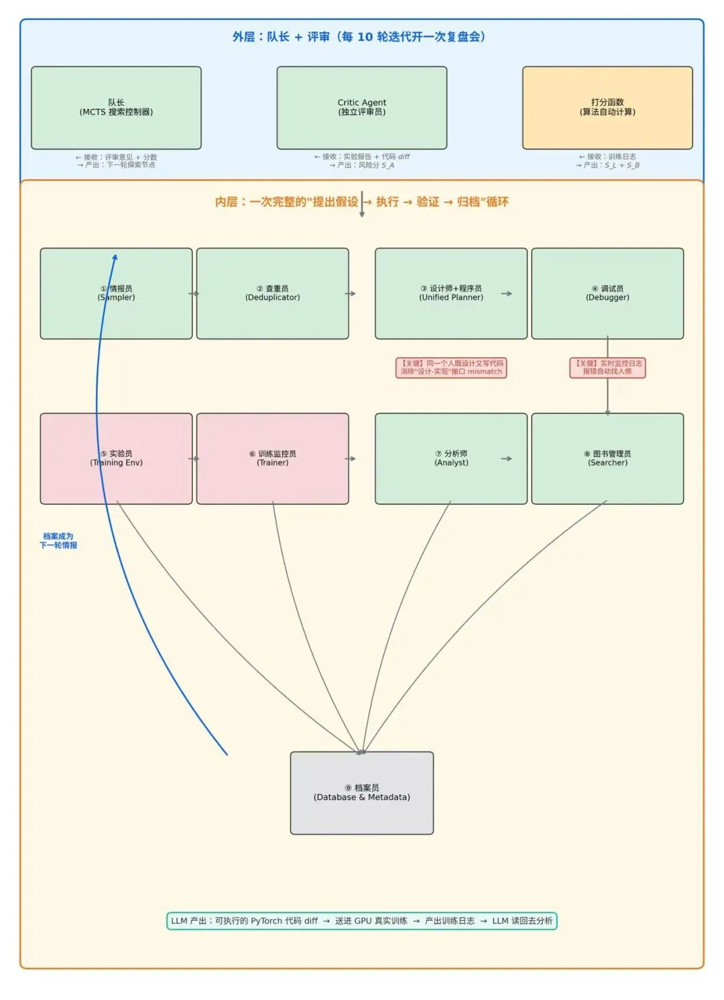
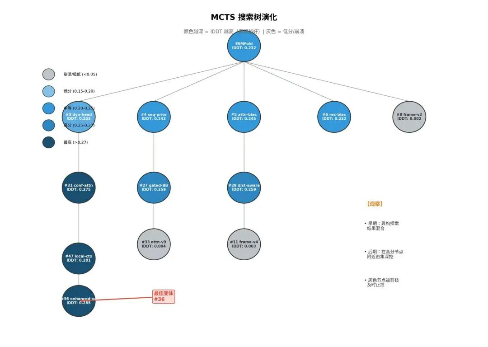
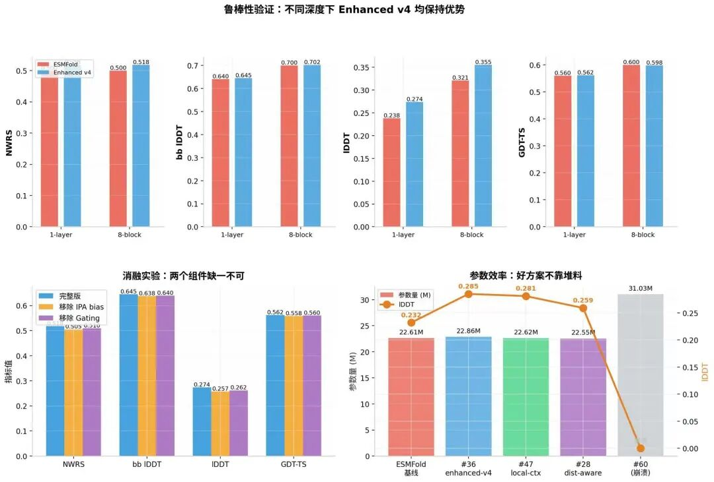

# 【论文导读】AgentFold：当 AI 学会像一支迭代团队那样工作

> 原文首发于微信公众号「Wenyan的呜哇」，2026-08-30。[阅读原文](https://mp.weixin.qq.com/s/DQON3tXQu91wwIvLiUfhDQ)

**原文：** _AgentFold: Closed-Loop Agentic Search for Protein Folding Model Design_（arXiv:2608.26747）

**作者：** Mingquan Liu, Jiangyu Chen, Hanqun Cao 等（湖南大学、南京大学、香港中文大学、浙江大学、耶鲁大学、斯坦福大学等）

**开源：** https://github.com/lmqfly/AgentFold

这是一篇来自蛋白质折叠领域的前沿论文，但它回答的问题却与每个技术团队息息相关：如何让 AI 不只是"出主意"，而是真正走完"假设—执行—验证—学习"的完整闭环。

---

## 一、引子：迭代中的隐性成本

几乎每个技术团队都在经历类似的循环：

**场景一：** 团队花了两周调出一套新方案，上线后核心指标涨了，但关联指标掉了。复盘会上，大家争论不休——到底是上游的问题，还是下游的权重过拟合了？当时的实验记录散落在三个文档里，关键决策的上下文已经没人记得清。

**场景二：** 让 AI 助手帮忙重构核心模块，它一次性改了 18 个文件，本地编译通过，上线后核心链路延迟飙升。回滚之后，没人知道那 18 个文件里哪些改动是安全的、哪些是罪魁祸首，因为 AI 的上下文已经重置，它不记得自己上周写过什么。

**场景三：** 跑了一百组实验，只记录了"哪组赢了"，却没人系统整理过"为什么这组输了"。三个月后，一个新同学提出了一个"全新"的思路，资深同事一听："这个我们去年试过，当时因为样本偏差导致指标震荡，最后放弃了。"

这些场景的共同痛点是：**我们有很多"出主意"的环节，却缺少"主意被验证后系统性地沉淀经验"的环节。** 成功的经验靠口头传播，失败的经验靠人脑记忆，迭代效率被严重拖慢。

如果有一个系统，能像一支经验丰富的迭代团队那样——自己提出假设、动手执行、收集反馈、从失败中学习、智能决定下一步该往哪投入资源——会怎么样？

这篇论文给出的答案，来自一个看似遥远的领域：蛋白质折叠。

---

## 二、这篇论文做了什么？

AgentFold 是一个多智能体框架，它的任务是在**蛋白质折叠**这个高难度科学领域，**自主改进一个大型机器学习模型**。

听起来离日常场景很远，但它的核心挑战与业务迭代惊人地相似：

| 蛋白质折叠场景 | 日常迭代场景 |
| --- | --- |
| 代码库超过 2000 行，模块高度耦合，改一处可能崩全局 | 核心系统代码复杂，重构时牵一发而动全身 |
| 每次实验需要数千小时 GPU 训练，验证成本极高 | 全量实验需要大量流量和算力，不能无限试错 |
| 结果不是简单的对/错，需要综合多个指标判断 | 策略上线不能只看单一指标，要平衡多个目标 |
| 需要领域知识才能解读实验结果 | 需要业务理解才能判断实验现象背后的根因 |

AgentFold 的起点是一个开源的蛋白质折叠模型 ESMFold。它的目标很简单：**让 AI 自主地、闭环地、可复现地改进这个模型。**

它做到了。在消耗约 5000 小时 GPU 和 1.7 亿个语言模型 token 后，AgentFold 探索了约 80 个模型变体，将最佳预测准确度提升了 7.5%，而且最佳变体只增加了不到 1.1% 的参数。

更重要的是，它从整个迭代轨迹中，总结出了三条可复用的设计规律——这些规律对蛋白质折叠领域的真人科学家都有指导意义。

---

## 三、组织架构：十个角色，各司其职

AgentFold 最值得关注的地方，不是它用了多大的模型，而是它的**组织架构**。它没有一个"万能的大模型"包办一切，而是让十个专门化的 Agent 像一支真实团队那样协作。

**先澄清一个容易混淆的点**：AgentFold 属于 Harness 层（系统编排层），也就是说，**LLM 本身没有被训练或微调**，它只负责推理。但系统里确实出现了"训练"和"训练日志"——这是因为 LLM 写的代码会被送到 GPU 上，**真正被训练的是蛋白质折叠模型**（ESMFold 的变体）。训练日志是这个底层模型训练产生的反馈信号，Agent 团队读取这些日志来做决策。可以把它理解为：LLM 是炼丹炉的控制系统，蛋白质模型是炉子里的丹药，炉温日志是控制系统的输入。

下图展示了十个角色的分工和协作关系：

### 3.1 LLM 到底在写什么？

很多人问：LLM 在 AgentFold 里到底产出什么？答案是**真正的、可执行的算法代码**——不是伪代码，不是思路描述，而是可以直接送进 GPU 训练的 PyTorch 代码。

具体来说，LLM 会根据当前要改进的方向，写出类似这样的代码修改：

- "在 IPA（Invariant Point Attention）层之前，插入一个 residue-index-conditioned 的 bias MLP"
- "把 BackboneUpdate 改成带门控的版本，用 sigmoid 控制更新强度"
- "在 trunk 的 chunk 边界加一个 bias 项，处理不连续性"

这些修改会被应用到 ESMFold 的 2000+ 行代码库中，然后**真实训练**几个小时，产出训练日志和评估指标，再被 LLM 读回去分析。

所以 LLM 的角色是**代码的作者 + 实验的分析师 + 方案的评审员**，但本身**不被训练**。

### 3.2 两个关键设计细节

**第一，"设计师"和"程序员"必须是同一个人。**

传统多 Agent 系统经常把"架构设计"和"代码实现"分给两个 Agent：一个出方案，另一个写代码。但在高度耦合的系统里，"想的"和"做的"很容易不一致——就像一个人写了一份详细设计，另一个人来实现，最后发现和预期不符。

AgentFold 的解法很直接：**让同一个 Agent 既做架构设计又做代码实现。** 这个 Agent 叫 Unified Planner，它消除了"设计-实现"的接口风险。

**第二，调试员不是被动等待报错，而是主动监控。**

它不是"代码交给你，报错了告诉我"这种模式。而是代码一进入训练环境，调试员就**实时盯着日志**，一旦发现异常立即自动联系设计师，告诉它"第 X 行有个 shape mismatch，建议改成 Y"。然后设计师修完，调试员再跑，再报错再修，循环直到训练成功启动。

这比"生成代码 → 报错 → 人类修"的模式前进了一大步。

---

## 四、队长怎么"下棋"：MCTS 树搜索详解

如果让 AI 随机提 80 个改进方案一个个试，5000 小时 GPU 根本不够用，而且大部分方案可能是重复的、低价值的。

AgentFold 的做法是 **MCTS 树搜索**——也就是 AlphaGo 下围棋时用的那种搜索策略。

### 4.1 搜索树的结构

想象一张"藏宝地图"：

- **根节点：原始 ESMFold 模型**
- **每个节点：一个可执行的模型变体（一套具体的 PyTorch 代码）**
- **父子关系：子节点是在父节点代码基础上做的修改**
- **边的权重：这个修改带来的效果分数**

论文里的实际搜索树长这样：

**观察到的搜索行为**：

- **早期：采样异构编辑，结果混合（探索阶段）**
- **后期：在高分变体附近形成更密集的分支（利用阶段）**
- **灰色节点：低分变体，后续被剪枝或降低优先级**

### 4.2 队长怎么决定下一步？

队长手里有三个信息源。这里再强调一次：**这些分数全部来自底层蛋白质模型的训练结果，LLM 本身没有被训练。**

| 信息源 | 谁提供 | 作用 | 来源 |
| --- | --- | --- | --- |
| **训练 loss 分 S_L** | 打分函数自动从训练日志提取 | 模型学得好不好 | 底层蛋白质模型训练日志 |
| **基准测试分 S_B** | 打分函数自动从评估结果提取 | 预测准不准 | 底层蛋白质模型评估结果 |
| **评审分 S_A** | Critic Agent 独立评审 | 这个方案靠不靠谱，会不会搞崩训练 | LLM 读报告后的推理判断 |

**总评分公式**：`S_total = S_L + S_B + S_A`

**关键设计**：Critic Agent 的 `S_A` **只用于决定"下一轮先探索哪个分支"**，不用于声称"这个模型最终有多强"。这避免了"自己给自己打分"的循环论证。

### 4.3 Top-k 采样策略

队长不是只选一个最好的节点往下走，而是**从同一个父节点下面同时挑 k 个有潜力的兄弟节点一起探索**。

这样做的好处是**形成近控制对比**：大部分代码相同，只改变特定干预，便于后续归因——"到底是哪个改动带来了效果变化？"

### 4.4 为什么不是实时更新？

传统 MCTS 每下一步棋就更新一次树，但 AgentFold 做不到——因为**每次 rollout 对应一次昂贵的训练/评估作业**（GPU-hours 级别，底层蛋白质模型要真实训练）。

所以队长采用**批量定期更新**：每 10 次迭代开一次"复盘会"，汇总最近 10 轮实验的结果，统一更新整棵树的节点值，然后决定下一轮往哪走。

---

## 五、为什么"记住失败"比"记住成功"更重要？

AgentFold 有一个反直觉的设计：**失败的实验也要详细存档。**

在科研中，知道什么路走不通，和知道什么路走得通，一样值钱。如果 AI 每次失败都忘了，下次可能又提同样的烂主意，白白浪费几千小时 GPU。

AgentFold 的档案里存的不是简单日志，而是结构化的干预记录：

| 字段 | 内容 |
| --- | --- |
| 父变体 | 基于哪个版本修改 |
| 编辑类型 | 先验 / 精修控制 / 几何操作 |
| 代码 diff | 具体改了哪行 |
| 稳定性信号 | 训练是否崩溃 |
| 指标 delta | lDDT、GDT-TS、RMSD、TM-score 的变化 |
| 归因分析 | 为什么有效/无效 |
| 关联文献 | 支持或反驳的外部证据 |

**查重员的工作流程**：

新方案提出 → 查重员翻档案 → 如果发现"三个月前有个几乎一样的方案，因为 X 原因失败了"→ **拦截，换方向**

这和日常工作中的**实验知识库**是同一个道理。很多团队只记录"哪组实验赢了"，但"为什么这组输了"同样值钱。如果一个策略因为"样本偏差导致指标震荡"而被放弃，三个月后不应该有人再重新提出同样的策略。

---

## 六、实验结果：花 5000 小时 GPU，换来了什么？

### 6.1 核心数据

AgentFold 在约 80 个模型变体上做了实验，核心结果如下：

- **最佳变体：lDDT（局部结构准确度）提升 7.5%（相比同等预算下的独立 AI 提案基线）**
- **参数效率：最佳变体只增加了 1.1% 的参数；另一个强变体只增加了 0.07%**
- **对比验证：在相同评估预算下，显著优于"一次性提 80 个方案互不关联"的基线，也优于随机搜索**

**关键发现**：增益来自架构设计的"巧劲"，而非"蛮力"堆参数。一些增加了大量参数（28M~32M）的变体并未表现更好，甚至直接崩溃。

### 6.2 消融实验与鲁棒性

对最佳变体的拆解显示，它的两个核心组件是**互补**的，缺一不可：

- **IPA 偏置机制：改变注意力期间信息的路由方式**
- **BackboneUpdate 门控：控制结构更新的应用强度**

单独移除任何一个，准确度都会明显下降。这说明最佳方案不是"某个银弹"，而是**多个机制协同作用**的结果。

---

## 七、AI 自己总结出的三条规律

AgentFold 最震撼的贡献，是从 80 次实验的轨迹中，提炼出了三条可复用的设计模式。这些规律对蛋白质折叠领域的真人科学家都有指导意义。

### 规律 1：先引导，后定型

> 在蛋白质结构还没成型的时候，轻轻推一把（加软偏置），效果最好；等结构已经成型了，再去硬掰几何形状，容易崩。

**日常类比**：就像产品早期应该用小流量快速验证方向，而不是等系统已经复杂了再做大重构。在"泥还软的时候塑形"，等"泥干了再敲"就裂了。

### 规律 2：用"阀门"控制，别用"锤子"硬砸

> 用门控机制（像水龙头阀门）控制更新强度，比直接加一个固定偏移量（像锤子砸）更稳定。

**日常类比**：做策略调优时，用渐进式灰度（阀门）比全量一刀切（锤子）更安全。乘法门控可以在不确定区域自动抑制更新幅度，加法强制则容易过冲。

### 规律 3：别让错误信号回传放大

> 不要把几何信息反馈回注意力层——如果初始几何不准，错误会在后续步骤中被放大。

**日常类比**：就像不要把未经清洗的下游数据直接反馈回上游特征工程，否则数据质量问题会被层层放大。错误在闭环中传播时，需要设置"防火墙"。

---

## 八、七点非通用的落地启示

AgentFold 属于 Harness 层，它的思想可以直接迁移。但下面这七点**不是业界常识**，而是论文中真正独特的机制设计。

### 启示 1：设计者和实现者必须是同一个人

AgentFold 的 Unified Planner 既做架构设计又写代码。传统分工是"一个人出方案、另一个人实现"，但论文发现这在紧耦合系统里会产生**接口 mismatch**——设计者想的和实现者理解的不是一回事。

**为什么在高耦合系统里，这个 mismatch 的代价极高？**

蛋白质折叠模型的代码高度耦合——序列表示、配对表示、几何精修、循环回收，这些模块像齿轮一样咬合在一起。如果让两个 Agent 分工，很容易出现这样的偏差：

| 设计 Agent 想的 | 实现 Agent 可能理解的 | 实际后果 |
| --- | --- | --- |
| "在 IPA 注意力层前加一个偏置" | 在 IPA **后**加了一个偏置 | 偏置没起到引导注意力的作用，训练白跑 |
| "用 residue index 信息做条件" | 用了 residue index，但**维度没对齐** | 训练直接报 shape mismatch，GPU 空转几小时 |
| "加一个轻量级的门控机制" | 加了一个**复杂的 LSTM 门控** | 参数量暴增，训练变慢，且和原设计意图不符 |

**关键问题**：这些错误在代码写出来之前发现不了，只有送进 GPU 训练几小时后才会暴露。而 AgentFold 的每次训练就是数小时 GPU 时间，**一次理解偏差 = 几千块钱白烧**。

当同一个 Agent 既做设计又写代码时，它想"在 IPA 前加偏置"的时候，**脑子里已经在写代码了**——"我需要在 `ipa_forward` 函数入口处，插入一个 `bias_mlp(residue_index)`，输出 shape 要匹配 pair representation"。如果它发现"这个设计在代码层面不好实现"，它会**当场调整设计**，而不是等另一个 Agent 报错后再返工。

**这和日常开发的区别**：

你可能会说"我们日常也是产品经理出 PRD、开发写代码，不也跑得好好的？"区别在于系统的耦合程度。做新页面（低耦合）时，PRD 写清楚 UI 布局，开发基本能还原；但改蛋白质折叠模型的注意力机制（极高耦合）时，动一行代码可能影响 5 个下游模块，shape、梯度、循环依赖全部要重新验证。在**高耦合系统**里，"设计意图"和"代码实现"之间的 gap 会被放大成**昂贵的训练失败**。AgentFold 的解法不是"加强沟通"，而是**直接消除沟通的必要性**——让同一个人既想又做。

**落地做法**：

- 用 AI 辅助开发时，**不要让一个 Agent 写 PRD、另一个 Agent 写代码**。让同一个 Agent 既描述思路又动手实现。
- 如果必须分工，让设计者在实现阶段**持续在场**，而不是交出去就不管了。

### 启示 2：用"批量复盘"代替"实时反馈"

传统 MCTS 每步都更新，但 AgentFold 每 **10 轮迭代**才开一次复盘会。因为每次实验成本极高，频繁复盘反而浪费注意力。

**落地做法**：

- 不要每次小实验都开复盘会。**攒 5-10 个实验一起复盘**，更容易看出模式。
- 早期探索阶段"广撒网、低流量、少复盘"，等有信号了再集中火力深挖。

这和"快速迭代"的直觉相反，但在**验证成本高的场景**（大流量实验、长周期训练）里更有效。

### 启示 3：给实验加"查重"机制，而不只是记日志

AgentFold 的 Deduplicator 会**结构化检索历史档案**，判断新方案是否和过去的失败案例高度相似。如果相似，直接拦截。

**落地做法**：

- 维护实验档案时，不要只写"改了什么、结果如何"。要加**结构化标签**：
  - 改动类型（架构/策略/参数）
  - 失败原因（样本偏差/过拟合/耦合冲突）
  - 关联指标（哪个指标涨、哪个跌）
- 下次提新方案时，**先跑一遍相似度检查**："历史上有没有类似的改动？当时为什么失败？"

这和简单记笔记的区别在于：**查重是主动的、结构化的、可拦截的。**

### 启示 4：从失败轨迹中提炼规律，而不是只记结果

AgentFold 最震撼的输出不是模型本身，而是三条设计规律（P1/P2/P3）。这些规律不是调参调出来的，是从 **80 次干预轨迹中归纳**出来的。

**落地做法**：

- 复盘时多问一层："这次失败和之前哪次像？有没有**共同模式**？"
- 定期做**失败模式聚类**：把三个月内的失败案例按原因分类，看哪类问题重复出现。
- 把提炼出的规律写成"团队内部的设计原则"，比如"不要在系统复杂后做激进重构"（对应 P1：Bias before geometry）。

**关键区别**：普通复盘止于"这次为什么输"，AgentFold 式的复盘要回答"这类问题以后怎么避免"。

### 启示 5：Critic 只排序、不评分

AgentFold 的 Critic Agent 给每个方案打风险分 `S_A`，但论文明确限定：**这个分数只用于决定"下一轮先探索哪个分支"，不用于声称"这个模型最终有多强"**。

为什么？因为一旦 Critic 的分数被当作"最终成绩"，Agent 就会陷入**循环论证**——自己评审自己的方案，永远给自己打高分。

**落地做法**：

- 如果你用 AI 做代码评审或方案评估，**明确区分"排序分"和"最终分"**。
- 排序分可以用 AI 快速给，但最终质量判断必须靠**自动化测试、人工抽检或独立评审**。
- 不要让同一个 AI 既写方案又做最终验收。

### 启示 6：情报员做"可比性筛选"，而不是无脑塞历史

AgentFold 的 Sampler（情报员）不是简单地把所有历史记录塞给设计师，而是做 **Context Summarization（上下文简报）**——只提取和当前父节点"相似编辑类型或失败模式"的证据。

这意味着：如果当前要改的是"注意力层"，情报员不会把"优化器调参"的历史记录塞过去，因为**不可比**。

**落地做法**：

- 给 AI 助手喂历史经验时，不要一次性塞全部文档。
- 先做一个**相似性过滤**："当前要改的是推荐排序层，只提取过去和排序层相关的实验记录"。
- 这能大幅减少噪声，提高 AI 的决策质量。

### 启示 7：固定控制变量，让改进归因到设计本身

AgentFold 的所有 80 个变体，**训练超参数完全一致**（150 epochs、Adam、batch size 8、peak LR 1e-3）。论文明确说："We keep these training hyperparameters fixed across variants so that performance differences primarily reflect architectural interventions rather than per-variant hyperparameter tuning."

这是一个很强的实验控制设计。很多团队做实验时，同时改架构又改参数，最后根本分不清**到底是架构好还是参数撞上了**。

**落地做法**：

- 做架构/策略实验时，**先锁定一组基线超参数**，所有变体共用同一套配置。
- 只有当你确信某个变体确实更好后，才允许为它单独调参优化。
- 这保证了早期探索阶段的**归因清晰**——好就是设计好，坏就是设计坏，不是运气。

---

## 九、结语

AgentFold 的价值，不在于它改进了蛋白质折叠模型，而在于它验证了一种**新的复杂系统优化范式**：

> **AI 可以是一支自运转的迭代团队——提出假设、执行实验、从失败中学习、智能分配资源、最终产生可迁移的知识。**

在这个系统中，语言模型不是主角，而是**引擎**。真正的主角是三个机制：

- **闭环架构：让试错有反馈，而不是出完主意就结束**
- **结构化记忆：让经验不流失，成功和失败都要存档**
- **智能搜索：让资源不浪费，好钢用在刀刃上**

当我们谈论"AI 提效"时，我们谈论的不应该是"让 AI 生成更多代码或方案"，而应该是"让 AI 走完从想法到验证再到经验沉淀的完整闭环"。

只有闭环跑通了，迭代才能真正加速。
