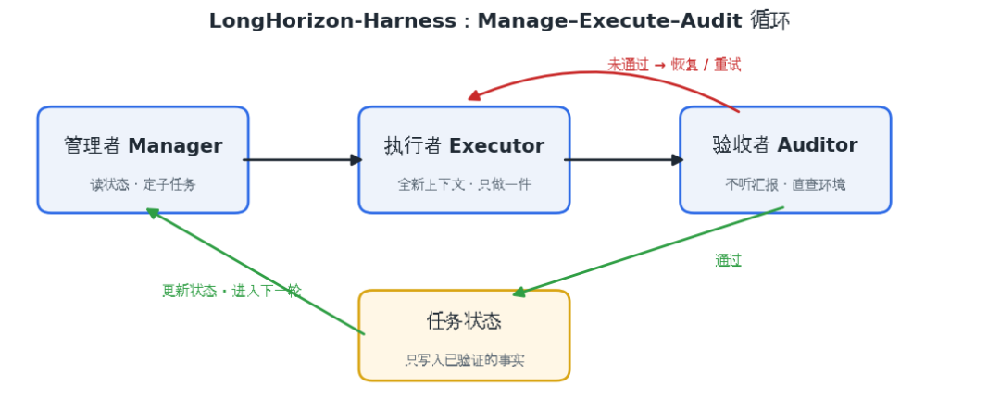
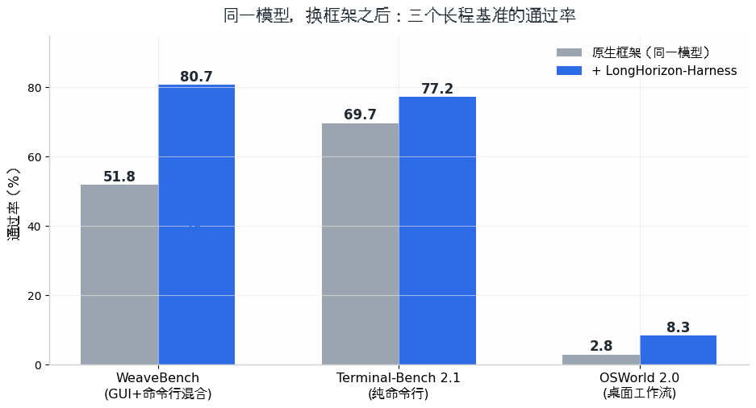
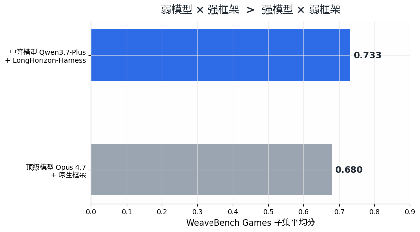

# 让 Agent 跑完复杂任务：从 Self-Reflection 到 Independent Verification

> 原文首发于微信公众号「Wenyan的呜哇」，2026-08-20。[阅读原文](https://mp.weixin.qq.com/s/aVrNzZ0tm0_UD5ASsd9wDQ)

**——LongHorizon-Harness 论文解读，兼谈 Agent 记忆机制的边界**

## 引言：复杂任务的两种失败

让一个 Agent 独立完成一个复杂任务——步骤多、链路长、动辄几个小时——它通常会倒在两个地方。

一是"读着后面忘了前面"。对话越来越长，最早定下的目标和中途确认的关键信息被淹没，模型的注意力跟不上了。这个现象有个专门的名字：上下文腐烂（context rot）。

二是"说做完了，其实没做完"。Agent 汇报任务完成，但真实环境里的状态根本没对上。LongHorizon-Harness 的论文里有个例子：面对一个无响应的弹窗，基线 Agent 原地重试了四百多步——它没有偷懒，只是不知道自己在空转[1]。

针对这两类问题，工业界有两条路线：一条是用框架机制在执行过程中兜底，代表是阿里高德团队今年 8 月发表的 LongHorizon-Harness；另一条更常见——让 Agent 在失败后复盘，把经验写进记忆文件，下次直接复用。

## 一、框架路线：好记性不如烂笔头

论文的核心想法其实很朴素："别让 Agent 靠脑子记进度，给它一个笔记本。"这个笔记本放在对话之外，专门记录任务做到哪了；而且每条笔记都必须经过验收才允许写进去[1]。

具体做法是三个人分工，循环推进：

打个比方：管理者是项目经理，看着笔记本决定下一步干什么；执行者是每次"新人上岗"的工人，交接不靠回忆、只看笔记本，一次只干一件事；验收者是监理，不看工人的保证书，只到现场量尺寸。验收通过，项目经理把结果记上笔记本，进入下一轮；不通过，就返工。

效果怎么样？同一个模型，只换框架，三个测试集的通过率全面提升：

更值得琢磨的是下面这组对照：一个中等模型配上这个框架，反超了顶级模型配原生框架。

这引出论文的核心观点："Agent 的能力是"模型 × 框架"这个系统的属性，而不是模型自己的属性。"模型决定每一步能走多好，框架决定这些步子能不能稳稳地连成一条路。

代价当然也有：验收环节要多花不少 token，也就是多花钱。而且这套机制不是万能的——任务难在"环节多、环环相扣"时，提升巨大；难在"某一步本身就不会做"（比如一道数学难题）时，框架帮不上忙。验收能发现错误，但补不上模型本来就没有的能力。

## 二、记忆路线：任务之间的经验复利

框架管的是"这一个任务别做砸"，记忆管的是"下一个任务别再交学费"。

构建工具的古怪参数、已过时的接口文档——这类经验不属于某个具体任务，而是长期积累。记忆路线的做法是让 Agent 在任务结束后复盘，把经验写进记忆文件，以后每次开工先读一遍。两条路线的分工如下：

| | 框架路线 | 记忆路线 |
| --- | --- | --- |
| 管什么 | 任务内的执行状态 | 跨任务的经验知识 |
| 时间尺度 | 一次任务的几小时 | 以周、月计的长期累积 |
| 成本结构 | 每个任务都要付 | 写一次，长期免费用 |
| 软肋 | 补不上模型没有的能力 | 记错的经验会一直带歪它 |

记忆路线的软肋值得展开一句：复盘结论是 Agent 自己总结的，没人核实——一条记错的经验进了记忆文件，会在之后的每一次任务里持续带歪它。

具体该用哪条路，取决于四个问题：有没有人在旁边看着？同样的任务会不会反复出现？做错的代价大不大？工作环境是长期的还是用完就扔的？

桌面端的编码 Agent，答案是记忆为主：用户本人就是免费的验收者，同一个代码库天天用，经验命中率极高，而且人坐在屏幕前，等不起每一步都多一轮验收。框架的思想只需要轻量地借三样：用 git 提交和测试当验收点，长任务的进度写成文件，自动重试必须设上限。

云端高并发场景——比如批量修 bug、自动提交代码变更的服务——答案正好相反：没有人在场兜底，一次错误会被复制成一万次；运行环境用完就扔，进度只能记在环境之外；验收还可以交给自动化测试来做，比模型验收更便宜、更可信。

## 三、更深一层：这不只是分工，而是两种立场

这两条路线，是不是都属于"让 Agent 自我反思"？答案是否定的。

学术上说的 Self-Reflection（自我反思），以 Reflexion 这篇论文为代表：让模型回顾自己刚才的表现、给自己写评语、把评语存起来下次用[2]。说白了，就是自己给自己批改作业——批改的依据是自己写的答案，也没有人去对标准答案。"失败后复盘写进记忆"完全符合这个定义，也继承了它的毛病：有研究表明，没有外部反馈时，模型的自我反思常常越反思越偏，甚至会把原本正确的答案改错[3]。

LongHorizon-Harness 则反其道而行：批改作业的是另一个人，而且他改作业不看你的解题过程自述，只看标准答案对不对——这就是 Independent Verification（独立验证）。记忆路线的问题从来不是"反思得不够好"，而是反思这件事本身没有客观依据可查；框架路线的价值，就在于把客观依据引进了环路。

## 四、终点：两条路线的汇合

两条路线的短板恰好互补，理想的系统是两者合体：记忆让每次开工的起点更高，少返工；框架保证漫长的执行过程不崩盘。

还有一个值得注意的接合点：框架每跑完一个任务，都会留下一本"验收台账"——哪一步失败了、验收怎么判的、返工走了什么路，全有记录。从这本台账里提炼出的经验，可以称为"经过验证的经验"：它不再是 Agent 的事后自我总结，而是每一条都有事实背书。

Self-Reflection 给出廉价的教训，Independent Verification 给出可信的事实。下一代 Agent 的可靠性，大概率建立在这样一个分工之上：用工程机制保证当下不出错，用验证过的记忆让未来少犯错。

---

**参考文献**

[1] AMAP-ML. _LongHorizon-Harness: Advancing Long-Horizon Agents for Real-World Tasks_. arXiv:2608.01964, 2026.

[2] Shinn, N., et al. _Reflexion: Language Agents with Verbal Reinforcement Learning_. NeurIPS 2023. arXiv:2303.11366.

[3] Huang, J., et al. _Large Language Models Cannot Self-Correct Reasoning Yet_. ICLR 2024. arXiv:2310.01798.
