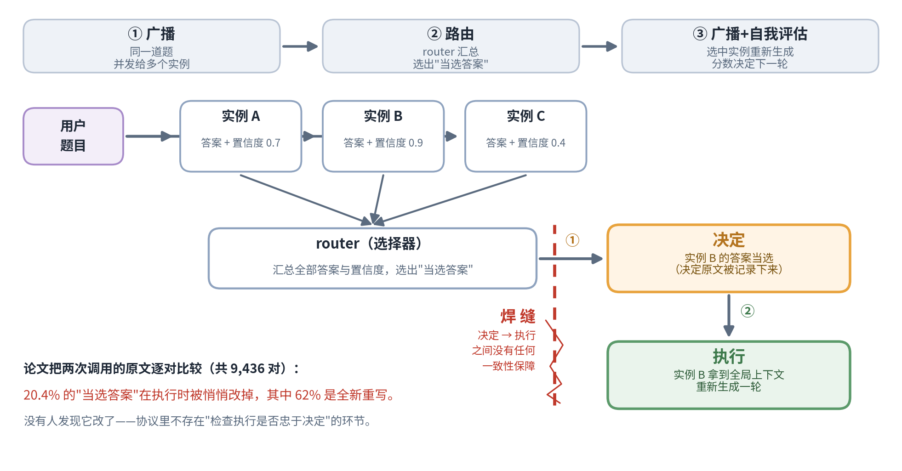
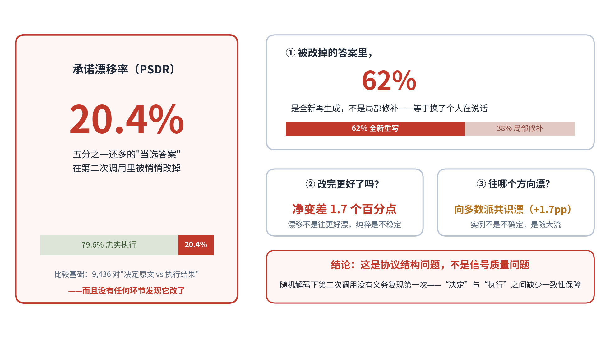
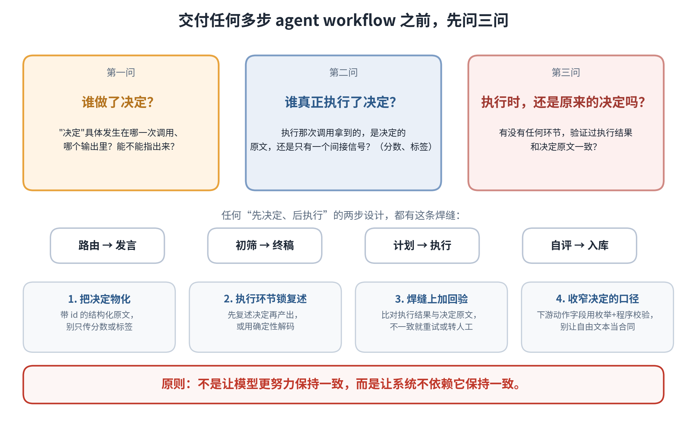

# Agent 的"决定"，有 20.4% 在执行时悄悄变了样

> 原文首发于微信公众号「Wenyan的呜哇」，2026-09-25。[阅读原文](https://mp.weixin.qq.com/s/NLLF3YUNDS8gquk5z6ALdQ)

有个看起来再自然不过的做法：

**先让模型给自己的答案报个置信度，再让这个数字替它做决定。**

比如，多候选答案时按置信度排序选一个；让模型判断"这一步有没有把握"，没把握就停下来问人，或降级给便宜模型；在反思循环里，让模型给上一轮表现打分，决定要不要重试；多 agent 协作时，让更自信的那个先发言。

这些场景有一个共同点：**模型自己报出来的一个数字，被拿去做后续的控制决策。**

本周读的这篇论文（*What Confidence Routing Is Actually Doing*，arXiv:2609.27822，2026），表面上研究"置信度路由"这个具体技术。它真正有价值的不是 routing（路由）本身，而是它借一个研究协议当实验台，照出了几乎所有 agent workflow 都可能有的一条缝：

> **第一次调用负责"决定"，第二次调用负责"产出"，而这两次调用之间，并没有任何机制保证它们说的是同一件事。**

## 一、先划清一个边界

研究界一直在探索用更多 test-time computation（推理时计算）换质量提升：2023 年的多模型 debate（辩论），2024 年的 Mixture-of-Agents（混合智能体），本质都是同一思路——让多个 LLM 实例多聊几轮，指望讨论挤出更好的答案。

但这里有个边界要划清：**做真实产品时，benchmark 上的准确率只是指标之一，还要同时考虑 token 成本、调用次数、延迟、稳定性和系统复杂度。** 一个需要几十次模型调用的 deliberation（多轮审慎讨论）协议，benchmark 上有效，也不意味着会成为常规工程架构。

事实上，今天产品级的 coding agent，流程控制大多走的是程序闸门——硬编码的检查、测试、权限确认，而不是"让模型再聊一轮看看"。所以"多 LLM 实例多轮讨论"是研究界为换准确率支付额外成本的路径，你会在论文里见到它，但未必会在生产环境里用上它。

这不意味着论文离我们很远。恰恰相反，作者选这个偏极端的协议是有用意的：它把"决定"和"执行"拆成两次显式调用，中间塞满干扰信息，等于把一个在所有 workflow 里都很隐蔽的问题放大到了可以逐对测量的程度。读它，不必接受它的架构，借实验台照一照实际在跑的流程就够了。

论文真正照出来的问题是：

> 一个 workflow 里，第一次调用做出的决定，到了第二次调用真正执行时，还是不是原来的决定？

## 二、实验台：confidence-routed broadcast（置信度路由广播）

后面的三个发现，全是作者从这个协议的运行记录里翻出来的，所以先花一分钟看懂它在干嘛。

协议分三步：**广播**——同一道题并发发给多个 LLM 实例，各自作答并自报置信度；**路由**——一个 router（选择器）汇总所有答案和置信度，选出一个"当选答案"；**广播 + 自我评估**——被选中的实例拿到全局上下文重新生成，再给自己的新答案打分，这些分数决定下一轮谁说话。

注意这个结构里最要紧的一点：**"做决定"和"执行决定"被拆成了两次独立的调用。** 决定发生在 router 选出"当选答案"的那一刻，执行发生在被选中实例重新生成的那一刻。普通系统里这两个时刻混在一起，漂移了也无从察觉；而在这个协议里，每次调用说了什么都有原文记录，"决定的原文"和"执行的结果"可以一对一对摆出来比——这正是它适合当实验台的原因。

实验规模：4,181 道题，底层模型 gpt-oss-120b，共 23,391 次投票，其中 9,436 对"决定 vs 执行"答案可供逐对比较。成本上，broadcast 比单 agent 基线多花 **12.8 倍 token、7.5 倍调用、4 倍时间**，换约 10 个百分点准确率——不是给人抄的架构，是实验台。

论文顺着协议的三道工序各做一类审计：看置信度报得准不准（校准，第三节），看 router 到底怎么选（路由，第四节），看重新生成时答案漂没漂（承诺，第五节）。前两个是铺垫，第三个才是重点。

## 三、铺垫一：自报的置信度，不像概率

先看校准。开头那些场景共用的那个数字——模型给答案自报的置信度——整体偏高：平均自报 **0.790**，实际正确率只有 **0.518**，差了 27 个百分点，典型的高估。

但光这么说会冤枉它。用 AUROC（衡量"排序能力"的指标：能不能把对的排在错的上面）来测，模型做到 **0.721**，相当不错的分数。论文里有一句很到位的总结：

> **ranks better than it calibrates**
>
> （译：**排序能力，好于它的校准程度。**）

这个数字作为排序信号能用，作为概率不合格：它能告诉你 A 比 B 靠谱，但不能告诉你 A 有八成把握。作者用 isotonic regression（保序回归）做后处理，ECE（期望校准误差）能从 0.278 压到 0.008——但那是事后校准，不改变原生输出的性质。

工程上的纪律很简单：**模型自报的分数一律当排序信号用，别当概率用。** 这件事业界多少有体感，真正的意义在下一个发现。

## 四、铺垫二：别在 router 上雕花

五种 router 策略（置信度加权、频次投票、Borda 计数（波达计分）等）比较下来：**策略之间差距不到 1.1 个百分点，但它们离 oracle（理想选择器：每次都选对）差了 4.8 到 5.9 个百分点。**

换句话说，router 怎么设计影响微乎其微；真正拉开差距的是答案池里有没有正确答案。router 再聪明，池子里没有也只能矬子里拔将军；池子里有，随便选选也能中。相关性分析也确认：路由表现和"正确答案在池中的频率"最相关，和任何置信度处理技巧都不相关。

别在 router 上雕花。凡是系统里有"多候选选一个"的环节，选哪个策略大概率不是准确率的瓶颈，候选池质量才是。真要投入，也优先投在让候选更丰富、更多样的地方。

当然，"选对"只是第一关——下一节会看到，就算 router 选对了，还有 20.4% 的概率在重新生成时被改掉。选没选对，管的是和 oracle 的差距；改没改掉，是选对之后紧接着的另一道关，两道是串联的。

## 五、主角：20.4% 的决定，没有被执行

回到第二节那张图。router 已经选出了"当选答案"——按理说，直接采用它就行了。但协议的第三步不是直接采用，而是把这个答案连同全局上下文（其他实例的答案、所有置信度）一起送回给胜出的实例，让它重新生成一轮：相当于给它一个"看了大家的答案之后再答一次"的机会，指望讨论收敛出更好的结果。

论文给路由选中答案这件事起了一个很准的名字：承诺。承诺的内容很具体：router 选出的这份"当选答案"，理应在接下来的环节被忠实产出——选中什么，就输出什么。于是他们把"选中的原文"和"重新生成的结果"逐对比较，看承诺兑现了多少。度量的指标叫承诺漂移率（PSDR，Promise Drift Rate）：

**20.4%。**

五分之一还多的"当选答案"，在第二次调用里被悄悄改掉了。拆开看：

- 被改掉的答案里，**62% 是全新再生成**，不是局部修补——等于换了个人在说话；
- 改完**净变差 1.7 个百分点**：漂移不是往更好的方向漂，纯粹是不稳定；
- 但漂移方向和"多数派共识"高度相关：实例不是不确定，是**随大流**，看到别人的答案后放弃了自己的立场。

很多人会以为这是校准问题的延伸——置信度不可靠，所以执行不可靠。不是。这是**协议结构问题，不是信号质量问题**。在 stochastic decoding（随机解码：每次按概率采样输出，不是唯一确定的结果）下，第二次调用本来就没有义务复现第一次的输出：第一次产出答案 A，是"那一刻的模型"在局部上下文里的采样；第二次面对的上下文已经变了（别人的答案、自我评估的任务、"你被选中"的信号），采出不同的东西是语言模型的正常工作方式，不是 bug。

但当你把这两次调用命名为"决定"和"执行"时，它就成了 bug。协议假设路由确立了一个决定、后续忠实执行它；实测发现这个假设五分之一的情况下不成立——而且没有任何环节发现它没成立。往深想一层，这其实是设计本身的矛盾：重新生成这一步，本意是给实例一个"看了大家答案之后改进"的机会；但"当选答案"又被当成本轮结论，继续参与后续环节。"允许改进"和"必须守诺"撞在一起，协议却没有规定哪头优先，也没有谁检查兑现。

关键是，这和 broadcast 无关。任何"先决定、后执行"的两步 workflow 都有这条焊缝：

> 路由 → 发言：选中的实例重新生成时，偏离了被选中的理由；
>
> 初筛 → 终稿：第一遍粗筛说"这条数据可信"，第二遍精写时悄悄改掉了判定依据；
>
> 计划 → 执行：plan（规划）阶段定了走 A 方案，act（执行）阶段落地时滑成了 A′；
>
> 自评 → 入库：自评打分针对回答 A，写入记忆库的却是改写后的回答 B。

照例泼冷水：这套分析是相关性不是因果——论文没跑 commitment-lock（承诺锁定：强制第二次调用复述第一次的决定）对照组，20.4% 里多少是协议强加、多少是模型本性还说不死；净效应 −1.7pp（百分点）在这个 benchmark 上也不算 catastrophic（灾难性的）。

但要看这个"决定"被拿去做什么：下游只是"选个答案交差"，这点漂移无所谓；下游是"因为这个决定，所以触发那个动作"——写库、发消息、调工具、不可逆操作——那就不是准确率的事，是正确性问题。

## 六、带走的东西：三问、一条清单、四条修法

把三个发现收拢成工程语言，是读这篇论文真正的收获。看任何多步调用的 agent workflow，先问：

1. **谁做了决定？** "决定"具体发生在哪一次调用、哪个输出里？能不能指出来？
2. **谁真正执行了决定？** 执行那次调用拿到的，是决定的原文，还是只有一个间接信号（分数、标签）？
3. **执行时，还是原来的决定吗？** 有没有任何环节验证过执行结果和决定原文一致？

检查出问题，修法不贵，按侵入程度从低到高：

- **把决定物化**：让决定以带 id（编号）的结构化原文存在（内容、理由、适用范围），执行调用的输入里显式带上它，而不是只传一个分数或标签。漂移最常见的温床，就是决定只以间接信号存在。
- **执行环节锁复述**：需要忠实执行的调用，用 quote-and-adhere（引用并遵从）约束——先复述或逐字引用决定再产出；或对这一环节直接用确定性解码（temperature 设为 0）加模板化输出，把随机性留给真正需要创造性的部分。
- **焊缝上加回验**：执行完成后，用程序闸门（schema（结构）校验、diff（文本差异比对））或一次独立调用比对执行结果和决定原文，不一致就重试或转人工。不可逆动作尤其值得做成硬闸门。
- **收窄决定的口径**：凡触发下游动作的字段，尽量让模型从枚举里选、程序做校验，别让自由文本充当合同。模型可以负责提选项，"哪个选项生效"交给确定性逻辑。

另有一条通用纪律：**一个信号如果同时承担多种职能**（路由里排序、执行里作证、评估里当裁判），**拆开分别审计**——多职能信号最容易被系统性误用。

这四条修法遵循同一个原则：**不是让模型更努力保持一致，而是让系统不依赖它保持一致。** 这和 coding agent 用程序闸门做流程控制，是同一个哲学。

## 结语

回到开头那个"再自然不过"的做法。

校准（Calibration）说：模型自报的数字不可全信。路由（Routing）说：那个数字怎么用，没那么重要。都是铺垫。

真正值得记住的是第三个发现：**在随机解码（stochastic decoding）下，第二次调用没有义务复现第一次的输出**——这在大多数场景是特性，但一旦你把它命名为"决定"与"执行"，它就是一条会渗水的缝。

这篇论文表面研究 confidence routing（置信度路由），真正有意思的是它发现了一件事：

> **你以为 agent 已经做出的决定，到了下一次调用里，可能根本没有被忠实执行。**

修复它不需要更聪明的模型，只需要设计 workflow 时把三问放在心上：

**谁做了决定？谁真正执行了决定？执行时，还是原来的那个决定吗？**

---

参考论文：*What Confidence Routing Is Actually Doing: A Trace Audit of an Agentic Deliberation Protocol*，arXiv:2609.27822（2026）。
