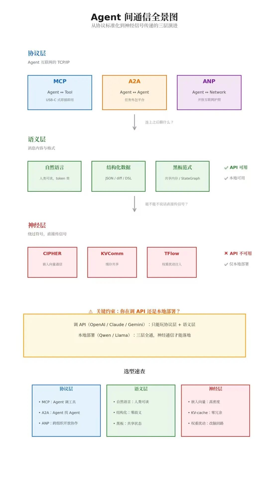

# 多智能体 LLM 系统通信机制：从协议标准化到神经信号传递

> 原文首发于微信公众号「Wenyan的呜哇」，2026-09-05。[阅读原文](https://mp.weixin.qq.com/s/TD4IvKITfmww_DprfJ7WJA)

---

## 1 MAS 是什么

MAS（Multi-Agent System，多智能体系统）指多个自主 Agent 在共享环境中协作完成任务的系统。与单 Agent 系统（一个 LLM 实例包办所有事）不同，MAS 把任务拆给不同专长的 Agent（如研究员、程序员、测试员）并行处理，以突破单个 LLM 的能力边界。

本文讨论的核心问题是：多个 Agent 之间如何高效通信。无论是协议层（MCP/A2A）、内容格式（自然语言/结构化/神经信号）还是协调策略，本质上都在解决这一个问题。

---

## 2 问题定义：为什么通信机制是 MAS 的核心瓶颈

多智能体 LLM 系统（LLM-MAS）的通信开销常被低估。当前主流框架（AutoGen、CrewAI、LangGraph）默认采用自然语言消息传递，其成本结构如下：

- 生成成本：发送方需将中间推理结果序列化为 token；
- 预填充成本：接收方需重新编码所有传入消息；
- KV-Cache 膨胀：接收方的注意力缓存随消息长度线性增长；
- 信息损耗：不可序列化的中间信号（如注意力权重分布、隐状态拓扑）在文本化过程中丢失。

当 Agent 数量从 2 增长到 5-10 时，上述开销呈超线性增长。2025-2026 年的研究表明，通信优化带来的收益往往超过单 Agent 能力增强的收益。本文系统梳理通信机制的三层演进路线，并给出工程选型建议。

下面这张图把当前所有通信方案按抽象层级做了归类。先建立整体认知，再逐层展开细节。

---

## 3 协议层：系统间互操作的基础设施

### 3.1 MCP（Model Context Protocol）：Agent-Tool 接口标准

技术定位：JSON-RPC 客户端-服务器架构，定义 Agent（Host）与外部资源（文件系统、数据库、API）之间的标准调用契约。

关键设计：

- 传输层：stdio（本地）或 HTTP/SSE（远程）；
- 无状态设计：每次调用独立，Server 不维护会话；
- 能力发现：Server 通过 `tools/list` 暴露可用工具签名；
- 权限模型：Host 控制 Client 的资源访问范围。

工程现状：Anthropic 于 2024 年提出，2025 年捐赠给 Linux Foundation（AAIF）。截至 2026 年初，SDK 月下载量超 9700 万，成为事实标准。MCP 2.1（2026）新增无状态传输、增强权限验证和实时数据流支持。

选型考量：

- 适用于 Agent 与外部工具/数据源的交互；
- 不解决 Agent 之间的对等协作；
- 状态管理必须在应用层显式实现。

### 3.2 A2A（Agent-to-Agent Protocol）：Agent-Agent 对等协作

技术定位：HTTP + SSE 协议，支持 Agent 之间的任务委托、状态同步和结果流式返回。

关键设计：

- Agent Card：`/.well-known/agent.json` 声明能力、端点、认证方式；
- 任务生命周期：Task → Input → Artifact → Status，支持多轮和流式输出；
- 安全模型：OAuth 2.0 + Agent Card 签名验证。

工程现状：Google 于 2025 年提出，2026 年 4 月 v1.0 发布并捐赠给 Linux Foundation。AWS、Azure、GCP 已集成，150+ 企业组织采用。

与 MCP 的关系：互补。典型工作流：协调 Agent 通过 MCP 调用本地工具，通过 A2A 将子任务委托给对等 Agent。

选型考量：

- 适用于多 Agent 编排和任务外包；
- 协议级原生支持有状态、多轮协调；
- 实现和运维复杂度高于 MCP。

### 3.3 ANP（Agent Network Protocol）：开放互联网互操作

技术定位：基于 W3C DIDs（去中心化标识符）和 JSON-LD 语义图谱，支持跨组织、跨域的 Agent 动态发现与验证。

关键设计：

- 身份层：DID 文档 + Verifiable Credentials；
- 发现层：JSON-LD 能力图谱支持语义搜索；
- 传输层：加密通道（TLS 1.3 + 端到端加密）。

工程现状：早期阶段，社区驱动。与 MCP/A2A 的企业内网定位不同，ANP 瞄准开放互联网场景。

选型考量：

- 当前生产环境以 MCP + A2A 为主；
- ANP 适用于跨组织协作的长期储备。

### 3.4 协议层实证对比

Predoaia 等（2026）在软件工程任务上执行 450 次受控实验，对比三种架构：

| 架构 | 协调复杂度 | 状态管理 | 适用场景 |
| --- | --- | --- | --- |
| MCP-only | 低 | 应用层显式实现 | 简单工具调用、单 Agent |
| A2A multi-agent | 高 | 协议级原生支持 | 复杂多轮协作、任务委托 |
| Hybrid (MCP+A2A) | 中 | 分层管理 | 生产环境主流方案 |

结论：协议选择应匹配查询复杂度。简单任务用 MCP，复杂协作用 A2A 或混合架构。

---

## 4 语义层：消息内容与表示形式

### 4.1 自然语言通信

机制：Agent 输出自由文本，接收方将其作为 prompt 的一部分重新编码。

优势：人类可读、灵活、无需格式约束。

劣势：

- Token 密度低：大量 token 用于语法和礼貌用语；
- 歧义性：同一概念可有多种表述，下游 Agent 需二次解析；
- 信号丢失：注意力分布、置信度、推理路径等不可文本化。

适用场景：需要人类介入审计、调试或展示的中间环节。

### 4.2 结构化通信

机制：Agent 输出固定 schema 的数据（JSON、YAML、DSL、代码、diff）。

代表系统：MetaGPT（传递 PRD、API 设计、代码模块）、ChatDev（结构化开发工件）。

优势：

- 零解析歧义：下游 Agent 可直接消费；
- 可验证性：schema 校验保证格式正确；
- 信息密度高：无自然语言的冗余开销。

劣势：需要预先定义 schema，灵活性降低。

适用场景：流水线式协作（理解 → 检索 → 编辑 → 验证），如 Coding Agent 的代码审查链路。

### 4.3 黑板范式（Blackboard / Shared Memory）

机制：所有 Agent 向中央共享空间写入状态，按需读取。LangGraph 的 StateGraph 是典型实现。

优势：

- 解耦：Agent 之间无直接依赖；
- 异步：支持非阻塞协作；
- 可扩展：新 Agent 只需遵守写入/读取契约。

劣势：

- 单点瓶颈：中央存储的读写竞争；
- 冲突解决：并发写入需仲裁机制；
- 一致性：缺乏事务语义时可能出现状态不一致。

适用场景：多 Agent 共享上下文的场景，如个人助理的检索-推理-执行链路。

---

## 5 神经层：绕过符号表示的直接信号传递

### 5.1 嵌入空间通信

CIPHER（2024）

- 机制：发送方输出概率加权的嵌入向量分布，接收方将其作为 soft prompt 注入上下文；
- 信息密度：显著高于自然语言，保留更多语义梯度信息；
- 限制：跨模型兼容性差（不同模型的嵌入空间不对齐）；
- 可解释性：低，人类无法直接解读嵌入向量。

Interlat（2025）

- 机制：将隐藏状态压缩为低维表示传递；
- 优势：保留比 token 更丰富的中间计算信号；
- 限制：压缩率与信息保真度的 trade-off 需任务级调优。

### 5.2 KV-Cache 共享

KVComm（ICLR 2026）

- 机制：发送方将注意力机制的 KV-cache 直接传递给接收方，接收方无需重新计算前缀表示；
- 性能：token 开销降低一个数量级，推理延迟显著下降；
- 限制：要求收发双方为同架构模型（共享注意力机制）；
- 适用场景：多轮对话中的高频上下文传递。

### 5.3 权重空间通信

TFlow（arXiv:2605.13839）

- 机制：发送方的内部激活经可学习参数生成器映射为低秩 LoRA 扰动，临时注入接收方模型；
- 效果：接收方的生成行为被实例级微调，无需文本上下文扩充；
- 实验数据（3× Qwen3-4B）：
  - 相比单 Agent：准确率 +8.5pt，token -32.69%
  - 相比文本式三 Agent：token -83.27%，推理加速 4.6×
- 限制：
  - 要求同架构（已知固定接收方模型）；
  - 可解释性极低；
  - 需训练参数生成器，增加系统复杂度。

### 5.4 神经通信方案对比

| 方案 | 通信内容 | 跨架构 | 持久性 | 信息密度 | 可解释性 | 工程成熟度 |
| --- | --- | --- | --- | --- | --- | --- |
| 自然语言 | Token 序列 | 是 | 持久 | 低 | 高 | 生产级 |
| 结构化数据 | Schema 实例 | 是 | 持久 | 中 | 高 | 生产级 |
| CIPHER | 嵌入分布 | 否 | 瞬态 | 中 | 低 | 研究级 |
| Interlat | 压缩隐状态 | 否 | 瞬态 | 中高 | 低 | 研究级 |
| KVComm | KV-cache | 是（同架构） | 瞬态 | 高 | 低 | 接近生产 |
| TFlow | LoRA 扰动 | 是（同架构） | 瞬态 | 极高 | 极低 | 研究级 |

### 5.5 一个实际的约束：你在调 API，还是本地部署？

神经层方案有一个容易被忽略的前提：你需要对模型权重和内部状态有访问权。如果你调用的是 OpenAI、Claude、Gemini 等闭源 API，情况如下：

| 方案 | 调 API 能用吗？ | 原因 |
| --- | --- | --- |
| TFlow | ❌ 不能 | 需要把 LoRA 权重扰动注入接收方模型参数空间，API 完全不暴露权重 |
| KVComm | ❌ 不能 | 需要读取/传递注意力机制的 KV-cache，API 不暴露内部缓存 |
| Interlat | ❌ 不能 | 需要访问中间隐藏状态，API 只返回最终输出 |
| CIPHER | ⚠️ 几乎不能 | 发送方或许能拿到 embedding，但接收方无法将嵌入向量作为 soft prompt 注入标准 Chat Completion 接口 |

换句话说，调 API 时，神经层通信基本全军覆没。你只能走协议层（MCP/A2A）和语义层（自然语言、结构化数据、黑板）。神经通信目前只适用于本地部署开源模型或企业私有化部署的场景。

这不是说神经通信没有价值——而是提醒你在做技术选型时，先确认你的部署形态。如果你团队目前全部基于 API 调用，投入 TFlow 或 KVComm 的研究暂时不会有产出。务实的路径是先把结构化通信和黑板范式做到极致，等模型私有化部署条件成熟后再切入神经层。

---

## 6 协调策略：时序与拓扑

### 6.1 逐次发言（One-by-One）

每个 Agent 处理完所有前序消息后输出。Chain-of-Agents 采用此策略。

- 优势：推理链条严密，错误可追溯；
- 劣势：延迟随 Agent 数量线性增长，存在错误累积；
- 适用：需要严格逻辑依赖的任务（如数学证明、代码审查）。

### 6.2 同时发言（Simultaneous-Talk）

所有 Agent 并行生成输出。AutoAgents、EconAgent 采用此策略。

- 优势：创意涌现快，吞吐高；
- 劣势：状态陈旧（Agent 基于过时上下文决策），冲突频发；
- 适用：头脑风暴、创意生成等容错性高的场景。

### 6.3 同时发言 + 总结者（Simultaneous-Talk-with-Summarizer）

引入专门 Agent 定期聚合并发输出。CausalGPT、AgentCoord 采用此策略。

- 优势：兼顾并行效率与上下文一致性；
- 劣势：总结者的幻觉风险会放大到整个系统；
- 适用：需要平衡效率与一致性的中等复杂度任务。

---

## 7 安全考量

多 Agent 系统的通信攻击面显著大于单 Agent 系统：

| 攻击类型 | 描述 | 防护措施 |
| --- | --- | --- |
| 伪造指令 | 攻击者冒充可信 Agent 发送恶意消息 | Agent Card 签名验证 + DID 认证 |
| 消息篡改 | 传输中修改目标、参数或决策 | 端到端加密 + 消息完整性校验 |
| 重放攻击 | 复用旧的"批准/委托"消息 | 时间戳 + nonce + 会话绑定 |
| 发现服务投毒 | 注册伪造 Agent 诱导流量 | 能力图谱验证 + 声誉机制 |
| 提示注入 | 通过通信内容注入恶意指令 | 输入净化 + 沙箱执行 |

关键原则：最小权限、零信任（验证所有入站消息）、通信审计日志。

---

## 8 工程选型矩阵

### 8.1 按场景选型

| 场景 | 推荐协议 | 推荐内容格式 | 推荐协调策略 | 升级路径 |
| --- | --- | --- | --- | --- |
| 个人助理（RAG + 工具） | MCP | 结构化 JSON | 黑板范式 | 多专业 Agent 时引入 A2A |
| Coding Agent / IDE | MCP + A2A | 代码 + diff + 诊断 JSON | 阶段性交接 | 本地部署后尝试 KVComm |
| 多 Agent 研究/推理 | A2A | 自然语言 + 置信度评分 | Simultaneous+Summarizer | 本地部署后引入 TFlow |
| 智能客服（工单流转） | A2A | 工单状态 JSON + 会话摘要 | 逐次发言（状态机驱动） | 复杂工单引入专家 Agent 仲裁 |
| 电商搜索导购 | MCP | 用户意图 JSON + 商品特征 + 排序分 | 黑板范式（共享检索状态） | 多轮对话引入 A2A 做意图澄清 |
| 电商智能客服（售前/售后） | MCP + A2A | 订单上下文 + 知识库检索结果 + 话术模板 | 逐次发言 | 售后纠纷引入仲裁 Agent |
| 电商直播助手（选品/脚本/互动） | A2A | 商品卖点 JSON + 直播脚本 + 弹幕情绪标签 | 阶段性交接 | 实时互动引入 Simultaneous+Summarizer |
| 电商供应链（预测/补货/调拨） | MCP + A2A | 库存状态 + 需求预测 + 调拨指令 | 黑板范式（共享库存视图） | 多仓协同引入 A2A 分布式决策 |
| 内容平台审核（先发后审/先审后发） | A2A | 内容特征向量 + 风险标签 + 审核结论 | 逐次发言（严格依赖链） | 多模态审核引入 KVComm 做特征共享 |
| 内容平台分发（推荐/排序） | MCP | 用户画像 + 内容特征 + 排序分 | 黑板范式 | 实时个性化引入 A2A 动态组队 |
| 内容创作辅助（图文/视频） | A2A | 大纲 → 素材清单 → 草稿 → 修订标记 | 阶段性交接 | 风格一致性引入 KVComm 同步创作上下文 |
| 社交平台社区治理（风控/反垃圾） | MCP + A2A | 行为日志 + 风险特征 + 处置指令 | 逐次发言（可审计优先） | 团伙识别引入 Simultaneous+Summarizer 聚合多源信号 |
| 社交平台用户增长（拉新/留存/召回） | MCP | 用户分群标签 + 策略模板 + 效果指标 | 黑板范式 | 多渠道协同引入 A2A 做策略编排 |
| 广告投放（创意/定向/出价） | MCP + A2A | 创意素材 + 人群包 + 出价策略 + 效果反馈 | 阶段性交接 | 实时竞价引入黑板范式共享竞价状态 |
| 广告创意生成（文案/图片/视频） | A2A | 卖点标签 + 创意brief + 多版本素材 + AB测试结果 | Simultaneous+Summarizer | 同架构模型集群尝试 TFlow 做风格同步 |
| 金融风控（信贷/反欺诈） | MCP + A2A | 特征向量 + 决策规则 + 风险评分 | 逐次发言（可审计优先） | 策略 Agent 间引入结构化通信降低歧义 |
| 金融智能投顾 | MCP | 用户资产 JSON + 市场数据 + 组合建议 | 逐次发言（合规优先） | 复杂资产配置引入 A2A 多专家会诊 |
| 支付异常处理（告警/诊断/拦截） | MCP + A2A | 交易流水 + 风险特征 + 处置指令 | 逐次发言（严格依赖链） | 高频交易监控本地部署后引入 KVComm |
| 物流调度（路径/配载/时效） | A2A | 订单信息 + 运力状态 + 路径规划 + 异常标记 | 黑板范式（共享运力视图） | 多承运商协同引入 ANP（跨组织） |
| 物流客服（轨迹/理赔/退换） | MCP + A2A | 轨迹节点 + 理赔材料 + 处理结论 | 逐次发言 | 复杂理赔引入专家 Agent 仲裁 |
| SaaS CRM（线索/跟进/成交） | MCP | 客户画像 + 跟进记录 + 商机阶段 | 黑板范式 | 大客户管理引入 A2A 多角色协作 |
| SaaS 项目管理（需求/开发/测试/发布） | MCP + A2A | 需求文档 + 任务状态 + 代码评审 + 发布清单 | 阶段性交接 | 大规模项目引入黑板范式共享项目状态 |
| SaaS HR（简历筛选/面试/评估） | A2A | 简历结构化数据 + 面试评价 + 综合评分 | 逐次发言 | 多轮面试引入 Simultaneous+Summarizer |
| 游戏 NPC / 虚拟世界 | A2A / ANP（跨服） | 动作指令 + 情绪状态 + 环境事件 | 同时发言 + 环境黑板 | 同架构模型集群尝试 TFlow 做群体行为同步 |
| 游戏剧情生成（任务/对话/世界观） | A2A | 剧情大纲 + 分支节点 + NPC对话模板 | 阶段性交接 | 多人共享剧情引入黑板范式同步世界状态 |
| 游戏反作弊（行为/内存/外挂） | MCP + A2A | 行为日志 + 特征向量 + 封禁指令 | 逐次发言（安全优先） | 实时检测引入 KVComm 做特征流共享 |
| 教育个性化学习（诊断/推荐/评估） | A2A | 知识点图谱 + 学习路径 + 习题 JSON + 评估报告 | 阶段性交接 | 个性化记忆引入黑板范式长期状态 |
| 教育作业批改（客观/主观/作文） | MCP | 答案 JSON + 评分规则 + 批改标记 | 逐次发言 | 作文批改引入 A2A 多维度评估 |
| 医疗辅助（分诊/诊断/建议） | A2A | 病历结构化数据 + 诊断置信度 + 建议方案 | 逐次发言（安全优先） | 多科室会诊引入 Simultaneous+Summarizer |
| 医疗影像辅助（阅片/标注/报告） | MCP | DICOM 元数据 + 影像特征 + 结构化报告 | 阶段性交接 | 多模态融合引入 A2A 跨模态 Agent |
| 法律合同审查（提取/比对/风险） | A2A | 条款提取 JSON + 风险标签 + 修订建议 | 逐次发言（严谨性优先） | 大规模合同批量处理引入黑板范式 |
| 法律合规（法规更新/内部审查） | MCP + A2A | 法规条文 + 内部制度 + 合规检查清单 | 阶段性交接 | 跨法域合规引入 A2A 多法域 Agent |
| 本地生活外卖调度（接单/派单/路径） | A2A | 订单信息 + 骑手状态 + 路径规划 + 预计时效 | 黑板范式（共享运力视图） | 多平台运力协同引入 ANP |
| 本地生活商家运营（选品/定价/营销） | MCP | 经营数据 + 竞品信息 + 运营建议 | 逐次发言 | 连锁品牌多店协同引入 A2A |
| 实时协作（多人文档 / 白板） | A2A | OT/CRDT 操作指令 + 光标位置 | 同时发言 + 冲突仲裁 | 同架构时尝试 KVComm 做状态同步 |
| 软件测试（用例 → 执行 → 报告） | MCP + A2A | 测试用例 JSON + 覆盖率报告 + bug 描述 | 阶段性交接 | 回归测试高频执行引入 KVComm |
| DevOps 运维（监控/告警/自愈） | MCP + A2A | 告警 JSON + 日志片段 + 修复脚本 | 逐次发言（严格依赖链） | 高频诊断链路本地部署后引入 KVComm |
| 数据标注（采集/清洗/质检） | A2A | 原始数据 + 标注规范 + 标注结果 + 质检报告 | 阶段性交接 | 多轮质检引入 Simultaneous+Summarizer |
| 舆情监控（采集/分析/处置） | MCP + A2A | 舆情文本 + 情感分析 + 传播路径 + 处置建议 | 黑板范式（共享舆情视图） | 重大舆情引入 A2A 多部门协同 |
| 智能硬件（语音/视觉/控制） | MCP | 传感器数据 + 语音指令 + 控制信号 | 逐次发言（实时性优先） | 多设备协同引入 A2A 分布式控制 |
| 跨组织协作（供应链 / 法务） | ANP（长期） | JSON-LD | 按需协商 | 等待生态成熟 |

### 8.2 按通信频率选型

| 通信频率 | 推荐机制 | 理由 |
| --- | --- | --- |
| 低频（< 1次/任务） | 自然语言 / 结构化数据 | 可解释性优先，成本可控 |
| 中频（1-10次/任务） | 结构化数据 + 黑板 | 平衡效率与可维护性 |
| 高频（> 10次/任务） | KV-cache / 嵌入向量 | 降低 token 税和延迟 |
| 极高频（内部子系统） | TFlow（同架构时） | 理论最优效率 |

### 8.3 关键决策问题

在确定通信方案前，建议回答以下问题：

1. 协调拓扑：是否存在明确的中心协调者？还是纯对等网络？
2. 状态持久性：通信内容是否需要长期存档以供审计？
3. 跨模型需求：系统是否固定使用单一模型架构？
4. 可解释性要求：调试时是否需要人类可读的中件产物？
5. 延迟敏感度：通信延迟是否构成用户体验瓶颈？
6. 安全边界：Agent 是否跨越信任域（如第三方服务）？

---

## 9 开放问题与未来方向

1. 协议收敛：MCP、A2A、ANP 是否会像 TCP/IP 一样收敛为统一栈？还是由多协议网关（如 Agentverse）长期桥接？
2. 异构神经通信：TFlow 和 KVComm 要求同架构。如何在不共享权重空间的不同模型（GPT、Claude、Qwen）之间实现高效神经通信？
3. 可解释性-效率权衡：神经通信效率极高但黑盒化严重。生产环境中如何审计、调试和合规？
4. 动态带宽分配：Agent 系统能否根据任务复杂度动态选择通信抽象层级（自然语言 → 结构化 → 嵌入 → 权重）？
5. 安全标准化：Agent 通信的安全框架（类似 TLS 的"Agent Transport Layer Security"）尚未出现，是亟待填补的空白。

---

## 10 参考文献

| 论文/资源 | 核心贡献 | 链接 |
| --- | --- | --- |
| TFlow (Bao et al., 2026) | 权重空间通信，LoRA 扰动作为通信媒介 | arXiv:2605.13839 |
| KVComm (ICLR 2026) | 选择性 KV-cache 共享 | arXiv:2605.03884 |
| CIPHER | 概率加权嵌入向量通信 | 相关论文 |
| Interlat | 隐藏状态压缩表示传递 | 相关论文 |
| MCP Specification | Agent-Tool 标准协议 | modelcontextprotocol.io |
| A2A Specification | Agent-Agent 标准协议 | Google A2A |
| ANP Specification | 去中心化 Agent 网络协议 | agent-network-protocol.com |
| Beyond Self-Talk (2025) | LLM-MAS 通信机制综述 | arXiv:2502.14321 |
| LLM-Based Multi-Agent Orchestration Survey (2026) | 框架、协议、评估综合综述 | Future Internet 2026 |
| MCP vs A2A Comparative Study (2026) | 450 次实验的协议对比 | arXiv:2607.23884 |
| MCP/A2A Hybrid Benchmark (2026) | 混合架构性能基准 | arXiv:2603.22823 |
| Survey of LLM Agent Communication with MCP (2026) | 设计模式与 MCP 结合 | arXiv:2506.05364 |
