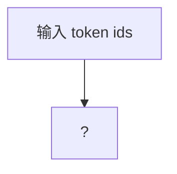

# nanoGPT 精读笔记

> 精读对象：[karpathy/nanoGPT](https://github.com/karpathy/nanoGPT)
> 日期：2026-09-28 当周 · 状态：🚧 进行中

## 它解决什么问题

<!-- 读完 README 后用自己的话写：一句话定位 + 设计哲学 -->

## 跑通记录

<!-- quickstart 步骤、环境、踩到的坑 -->

```bash
# 实际跑通的命令序列
```

## 核心模块调用链

<!-- 挑 GPT 模型类（model.py）：从 forward 入口到输出，数据怎么流 -->
<!-- 建议配一张手画的调用链图或 mermaid -->



## 关键设计决策

<!-- 例如：为什么用这样的参数初始化？为什么 weight tying？ -->

## 对我的 agent 项目的启发

<!-- 哪些思路能反哺 cortex：代码组织？配置方式？训练/推理分离？ -->

## 没搞懂 / 待深挖

<!-- 诚实记录，下周或以后回填 -->
